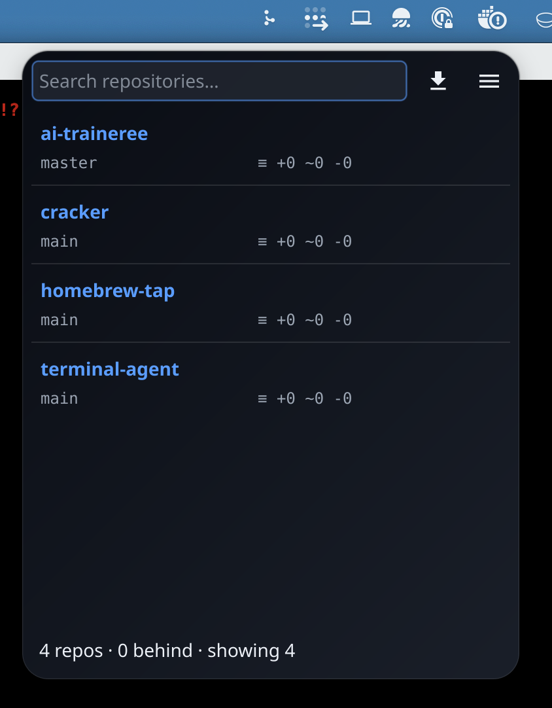
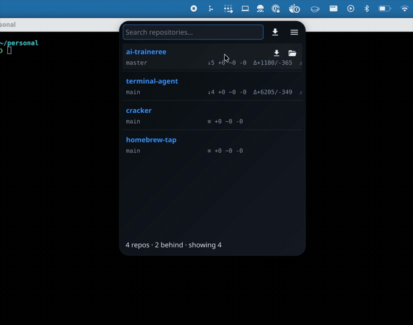

# Architecture

`git-repo-tracker` is a Go repo-tracking backend with platform frontends. The
current desktop frontend is a [Fyne](https://fyne.io) v2 tray app; a headless CLI
uses the same backend, and Linux/GNOME can grow a Shell-extension frontend on top
of the same service boundary. State flows one way: **discover → refresh → cache →
notify the frontend**.

## Layers

| Layer | Package(s) | Responsibility |
|-------|-----------|----------------|
| Frontends | `cmd/git-repo-tracker`, `cmd/git-repo-tracker-cli`, `internal/ui` | Native Fyne app and headless CLI entrypoints |
| Optional integrations | `integrations/gnome-shell` | GNOME Shell panel frontend; shells out to the CLI and can move to a separate repo |
| Backend | `internal/backend` | Shared service boundary over config + monitor for GUI, CLI, and future platform frontends |
| GUI | `internal/ui` | Tray menu, search popover, settings window, theme, tooltips, click actions; macOS-native bits (cgo) |
| Daemon | `internal/monitor` | Repo registry, the refresh schedulers, bounded worker pool, debounced change notifications, on-disk cache |
| API | `internal/git`, `internal/scan` | Per-repo git operations (status/fetch/pull/diff); filesystem discovery |
| Persistence | `internal/config` | YAML config — mutex-guarded, atomic writes, rollback on failure |
| Platform | `internal/loginitem` | Launch-at-login (macOS LaunchAgent / Linux XDG autostart) |

`cmd/git-repo-tracker` wires version/flags → loads backend config → constructs `ui.App` → runs.
`cmd/git-repo-tracker-cli` uses `internal/backend` without importing Fyne. The
GNOME Shell extension shells out to that CLI and renders GNOME-native panel menu
widgets, which is how it can support expandable sections and live updates on
Ubuntu/Fedora without AppIndicator limitations.

Layers communicate through a **single `onChange` callback**, not channels: the
monitor calls `onChange` when state changes; the UI marshals that onto Fyne's
main thread with `fyne.Do`. There are no channels between layers.

```
cmd/git-repo-tracker ─▶ ui.App ─▶ backend.Service ─▶ monitor.Manager ─▶ git / scan
                         ▲              │                    │
                         └── onChange ◀─┴────────────────────┘   (debounced; runs via fyne.Do)

cmd/git-repo-tracker-cli ─▶ backend.Service ─▶ monitor.Manager ─▶ git / scan
```

## Data flow & threading

1. **Startup is cache-first.** `monitor.New` loads `state.json` into the in-memory
   registry, and `Start` fires `onChange` immediately — so the tray/popover paint
   the last-known state *before* any git process runs.
2. **Two schedulers** run as background goroutines (`monitor.go`):
   - **localLoop** (default every 30 s) — cheap `git status --porcelain=v2 --branch`
     for every repo: branch, upstream, ahead/behind, dirty counts.
   - **remoteLoop** (default every 30 min, or on demand) — re-discovers repos,
     then `git fetch` each fetch-eligible repo and recomputes behind + line stats.
   Both re-read their interval from config each cycle, so settings changes apply
   without a restart.
3. **Bounded concurrency.** A refresh feeds repo paths through a `jobs` channel to
   a fixed pool of workers (`refreshWorkers = 8`), so scanning dozens of repos
   never forks hundreds of git processes at once. On cancellation the workers
   drain the channel and exit.
4. **Debounced notifications.** Per-repo updates call `notify()`, which a single
   `notifier` goroutine coalesces into at most one `onChange` per ~200 ms — a
   70-repo refresh becomes a couple of UI rebuilds, not 70.
5. **Locking.** The registry map is guarded by a `sync.RWMutex`. The UI only ever
   reads immutable `Snapshot()` copies; all UI view-state (maps, slices,
   `popVisible`, …) is touched only on the main thread.

## The git layer (`internal/git`)

We shell out to the user's `git` binary rather than use a pure-Go library, so we
inherit their SSH keys / credential helpers and match C-git's speed.

- **`GetStatus`** runs one `git status --porcelain=v2 --branch` — branch,
  upstream, ahead/behind (`branch.ab`), and per-file staged/modified/deleted/
  untracked counts, all from a single ~0 ms call.
- **`DiffStat`** uses a *three-dot* diff (`HEAD...<ref>`) — the merge-base→upstream
  change, i.e. exactly the lines you'd pull in.
- **`Fetch`** updates remote-tracking refs only (never the working tree).
  **`Pull`** is `--ff-only` — it never merges or leaves a conflicted state.
- **`exec.go`** resolves `git` once and augments `PATH` (`/opt/homebrew/bin`, …)
  plus sets `GIT_TERMINAL_PROMPT=0`, so background fetches fail fast instead of
  hanging on a credential prompt, even when launched from Finder/launchd.

## Discovery (`internal/scan`)

`Discover` walks each root concurrently with `filepath.WalkDir`, pruning
aggressively: it skips ignored directory names *first*, then on finding a `.git`
entry records the repo and stops descending (so submodules / nested clones aren't
double-counted), and honors a per-root depth limit.

## Caching (`internal/monitor/cache.go`)

The discovered repos + last-known status are persisted as JSON in the OS cache
dir (`~/Library/Caches/git-repo-tracker/state.json`). It's disposable — corrupt or
version-mismatched cache is ignored and rebuilt. Writes use a unique
`os.CreateTemp` + atomic rename, so the two refresh loops can both persist without
clobbering a shared temp file.

## Config (`internal/config`)

YAML, hand-editable, mutex-guarded. Mutations go through `update()`, which
snapshots the persistable fields, applies the change, writes atomically, and
**rolls back the in-memory state if the write fails** — so memory never diverges
from disk. See [CONFIGURATION.md](CONFIGURATION.md).

## UI specifics (`internal/ui`)

<p align="center">
  
  &nbsp;&nbsp;
  
</p>

Fyne is great for cross-platform widgets but lacks a few things a menu-bar app
wants; these are the non-obvious bits:

- **Tray popover.** A native tray menu can't host a text field, so the popover is
  a borderless **splash window**. Left-click toggles it (`systray.SetOnTapped`),
  right-click shows the menu; the search field is the window's content.
- **UI subpackages.** `internal/ui` owns Fyne app state and orchestration. Leaf
  UI concerns that do not need App state live in subpackages: `internal/ui/actions`
  for open-folder/editor/terminal commands and `internal/ui/trayicon` for tray icon
  resource rendering.
- **macOS native helpers** (`native_darwin.go`, cgo). Fyne exposes no window
  positioning, transparency, or focus-lost callback, so a small Cocoa shim:
  positions the popover under the cursor at the top of the screen, rounds the
  window corners (transparent corners via a content-layer mask + shadow), and
  observes `NSApplicationDidResignActive` to dismiss the popover on click-away.
  The `//export`ed Go callback lives in `native_darwin_export.go` (a cgo file
  using `//export` may only have declarations in its preamble). `native_other.go`
  provides no-op stubs for non-macOS builds.
- **List rows** (`repo_row.go`) are a custom `widget.BaseWidget` that's both
  `Hoverable` (reveal action icons) and `Tappable` (expand). The action icons are
  deliberately *not* Hoverable — the row hit-tests the pointer in `MouseMoved` to
  highlight them — otherwise moving onto a button would fire the row's `MouseOut`
  and the buttons would vanish. Expansion grows the row via `list.SetItemHeight`.
- **Marquee** (`marquee.go`) scrolls overflowing path/commit-message lines on
  hover by sliding a substring window — since it always renders a *fitting*
  substring, no clipping is needed.
- **Tooltips** (`tooltip.go`) are a non-intercepting overlay layered on top of the
  window content (Fyne 2.7 has no built-in tooltips, and `widget.PopUp` would
  capture clicks).
- **Theme** (`theme.go`) is a custom dark theme; the popover layers a gradient
  backdrop under the content to evoke a "glassy" look.

## Build & release

- **`Taskfile.yml`** — `build`, `run`, `test`, `check` (fmt+vet+test), `bundle`
  (macOS `.app`), `icon` (regenerate `icon.png` from the SVG), `linux-deps`,
  `release-snapshot`.
- **`.goreleaser.yaml`** — macOS arm64 + amd64 (CGO; amd64 cross-built via
  `clang -arch x86_64`) → archives + a Homebrew cask.
- **`.github/workflows`** — `test-and-tag` (test on macOS + Linux, then bump &
  push a SemVer tag from conventional commits) → `release` (GoReleaser + a Linux
  amd64 archive).
