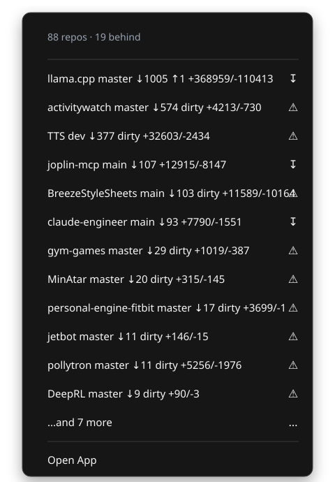

# git-repo-tracker

A fast, cross-platform **system-tray app that watches your local git repositories**.
It discovers repos under directories you configure, periodically checks how far
each branch is behind its `origin`, and surfaces the results in the menu bar plus
a searchable popover — inspired by [RepoZ](https://github.com/awaescher/RepoZ).

<p align="center">
  
</p>

## Features

- **Discovery** — recursively finds every git repo under your roots, pruned so
  even large trees scan in milliseconds.
- **Behind tracking** — a background `git fetch` (working tree never touched)
  reports how many **commits** and **lines** each repo is behind.
- **Instant startup** — last-known state is cached and painted before any git runs.
- **Search popover** — left-click the tray icon for a searchable, virtualized list.
- **Inline detail** — click a repo to expand its path and latest commit times;
  hover to reveal **pull** (fast-forward) and **open** icons.
- **Update all** — one button fast-forwards every repo that's behind.
- **In-app settings** — roots, intervals, open action, and launch-at-login.

<p align="center">
  
  &nbsp;&nbsp;
  
</p>

On Linux, the native AppIndicator menu stays intentionally modest: it lists repos
that are behind and provides **Open App** for the full searchable UI.

## Install

### Homebrew (macOS)

```sh
brew install --cask laszukdawid/tap/git-repo-tracker
```

### From source

Requires **Go 1.26+** and `git`. On Debian/Ubuntu, `task linux-deps` first.

```sh
task run     # or: go run ./cmd/git-repo-tracker
task build   # produces ./git-repo-tracker
```

## Status notation

`↑n` ahead · `↓n` behind · `≡` even with upstream · `+n` staged · `~n` modified ·
`-n` deleted · `?n` untracked · `Δ+a/-d` lines behind · `⚠` last fetch/status error.

## Where next

- **[Configuration](CONFIGURATION.md)** — every option, environment variables, the cache.
- **[Architecture](ARCHITECTURE.md)** — layering, concurrency, caching, and the Fyne/cgo internals.
- Contributing & agent notes live at the repo root
  ([CONTRIBUTING.md](https://github.com/laszukdawid/git-repo-tracker/blob/main/CONTRIBUTING.md),
  [AGENTS.md](https://github.com/laszukdawid/git-repo-tracker/blob/main/AGENTS.md)).
